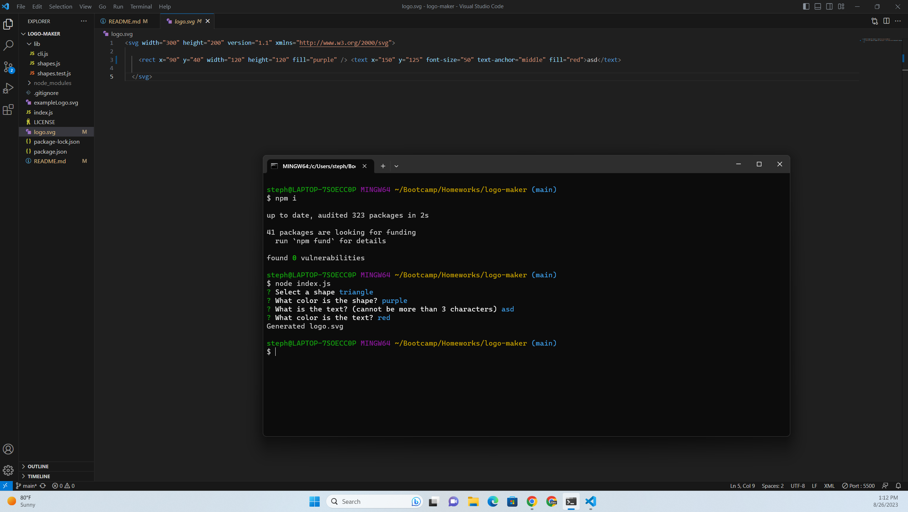

# Logo Maker

## I built this to be able to create simple and easy logos. It lets anyone make a simple logo extremely easily.

## To install this app you clone the repo from github.

## To use this app, navigate to this repo, run npm i, and then node index.js. After that answer the prompts and a logo will be made for you.

